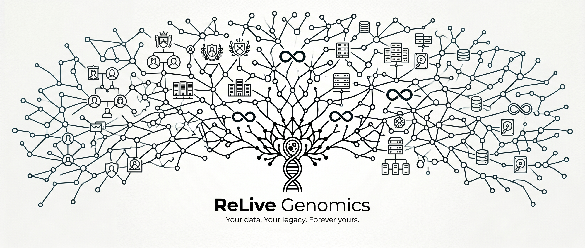
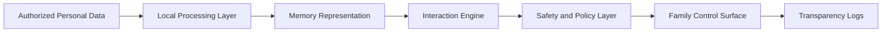

# ReLive Genomics

## Company Overview

ReLive Genomics is a computational biology and AI company building privacy-first living memory technologies.

The company mission is to give people the ability to preserve memory and emotional continuity with full consent, strong safeguards, and user ownership.

## Quick Links

- [Eterno product README](Eterno/README.md)
- [Master roadmap](Docs/RELIVE_GENOMICS_MASTER_ROADMAP.md)
- [Problems and solutions](Docs/PROBLEMS_AND_SOLUTIONS.md)
- [Founding conversation](Docs/FOUNDING_CONVERSATION.md)

## Company Structure

ReLive Genomics is the umbrella company.

| Entity | Role |
| --- | --- |
| ReLive Genomics | Company and core platform |
| Eterno | Product 1: privacy-first living memory system |
| Product 2 (TBD) | Future memory reconstruction product |

## Why It Exists

Most existing memory tools are retrieval archives. ReLive Genomics focuses on systems that can preserve context, emotional nuance, and family-defined boundaries in a responsible framework.

The target is remembrance with structure, not replacement.

## What The Company Does

At the company level, ReLive Genomics works across four tracks:

1. Product engineering: building local-first memory systems with consent and safety controls
2. Applied research: advancing multi-signal memory modeling and evaluation quality
3. Responsible deployment: developing guardrails for grief-aware interaction boundaries
4. Distribution and partnerships: building channels for trusted adoption

## Public Technical Direction (Company)

The company platform direction is modular so products can reuse core capabilities:

- Data ingestion and normalization for authorized personal content
- Memory representation and retrieval-aware indexing
- Response conditioning for style, context, and emotional continuity
- Safety and policy guardrails for topic and tone constraints
- Transparency and control surfaces for families and users

Detailed product implementation belongs in [Eterno/README.md](Eterno/README.md). This root README stays company-level.

## Company Principles

- Consent-first: data use is opt-in, scoped, and revocable.
- Local-first: privacy and control are central product requirements.
- Safety-by-design: interaction boundaries are built into the product.
- Transparency: users and families should understand what is captured and why.
- Dignity-first language: preserve memory, never claim resurrection.

## Responsible Use

ReLive Genomics develops systems for legacy planning and remembrance with authorized personal data.

They are not:

- Medical devices
- Mental health treatment systems
- Claims of consciousness transfer or identity re-creation

For high-vulnerability contexts, therapist-guided usage models are part of long-term deployment strategy.

## Current Development Focus

Current company priorities:

1. Local prototype quality and reproducibility
2. Consent, safety, and family control workflows
3. Applied research for memory faithfulness and emotional alignment
4. Evaluation standards for trust, misuse resistance, and long-term reliability

## Public Roadmap

1. Phase 0: proof-of-concept with local stack and self-data validation
2. Phase 1: MVP with guardrails, transparency, and family customization
3. Phase 2-3: research credibility and multi-signal integration
4. Phase 4+: go-to-market, partnerships, and long-term scale

## Product Portfolio

- Eterno (current): first product for privacy-first living memory
- Product 2 (planned): future memory reconstruction and comp-bio expansion

## Repository Scope

This repository contains company vision, product direction documents, and selected non-sensitive artifacts.

Not included in public materials:

- Personal user data and private datasets
- Internal risk models and security implementation details
- Proprietary prompts, benchmarks, and operational runbooks

## Collaboration

For research collaboration or product partnerships, open an issue with context and intent.
